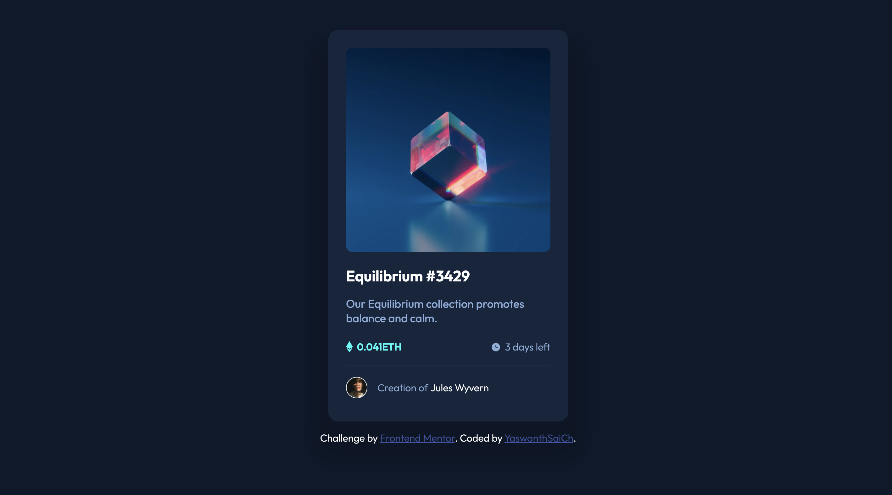

# Frontend Mentor - NFT preview card component solution

This is a solution to the [NFT preview card component challenge on Frontend Mentor](https://www.frontendmentor.io/challenges/nft-preview-card-component-SbdUL_w0U). Frontend Mentor challenges help you improve your coding skills by building realistic projects. 

## Table of contents

- [Overview](#overview)
  - [The challenge](#the-challenge)
  - [Screenshot](#screenshot)
  - [Links](#links)
- [My process](#my-process)
  - [Built with](#built-with)
- [Author](#author)

**Note: Delete this note and update the table of contents based on what sections you keep.**

## Overview
The challenge is to build out nft preview card component and to get it looking as close to the given design as possible.

### The challenge

Users can be able to:

- View the optimal layout depending on their device's screen size
- See hover states for interactive elements

### Screenshot

### Links

- Solution URL: [Add solution URL here](https://your-solution-url.com)
- Live Site URL: [Add live site URL here](https://your-live-site-url.com)

## My process

Used HTML and CSS knowledge to create this project.
- Created a container with required dimensions
- Added the elements to the container
- Styled the components using CSS and the given style-guide
- Made it responsive, so that it becomes user-screen friendly

### Built with

- Semantic HTML5 markup
- CSS custom properties
- Flexbox
- Mobile-first workflow

## Author

- Github - [YaswanthSaiCh](https://github.com/YaswanthSaiCh)
- Frontend Mentor - [@YaswanthSaiCh](https://www.frontendmentor.io/profile/YaswanthSaiCh)
- Twitter - [@Yaswanthsai_Ch](https://twitter.com/Yaswanthsai_Ch)

